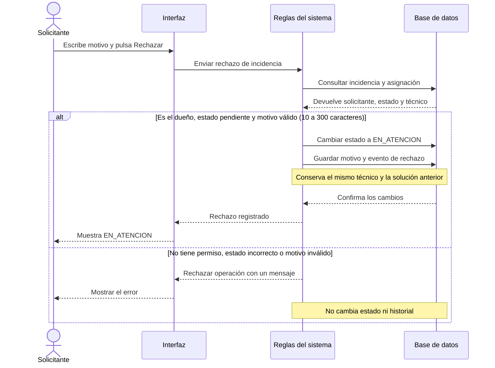

# Secuencia: rechazar una solución

**Estado:** Borrador, pendiente de revisión con las SPECS.

```mermaid
sequenceDiagram
    actor Solicitante
    participant Interfaz
    participant Sistema as Reglas del sistema
    participant BD as Base de datos

    Solicitante->>Interfaz: Escribe motivo y pulsa Rechazar
    Interfaz->>Sistema: Enviar rechazo de incidencia
    Sistema->>BD: Consultar incidencia y asignación
    BD-->>Sistema: Devuelve solicitante, estado y técnico

    alt Es el dueño, estado pendiente y motivo válido (10 a 300 caracteres)
        Sistema->>BD: Cambiar estado a EN_ATENCION
        Sistema->>BD: Guardar motivo y evento de rechazo
        Note over Sistema,BD: Conserva el mismo técnico y la solución anterior
        BD-->>Sistema: Confirma los cambios
        Sistema-->>Interfaz: Rechazo registrado
        Interfaz-->>Solicitante: Muestra EN_ATENCION
    else No tiene permiso, estado incorrecto o motivo inválido
        Sistema-->>Interfaz: Rechazar operación con un mensaje
        Interfaz-->>Solicitante: Mostrar el error
        Note over Sistema,BD: No cambia estado ni historial
    end
```
